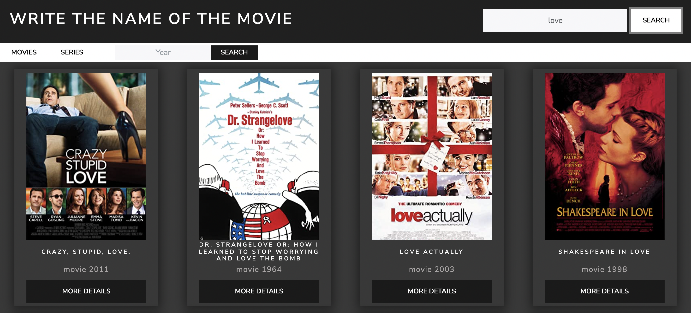
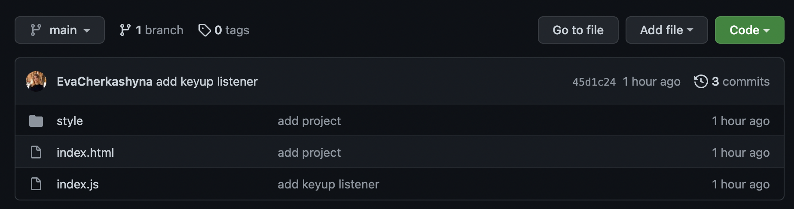

# Film Library

This is a film library where you can find movies by title and see information about them.

You can also use filters and search for movies or series by year.

I used OMDb API to access information about movies.

# Download instructions

1. Copy the link you can find by clicking on the green `code` button.
2. Write in terminal: `git clone "link"`.
3. The project will be copied to the selected folder.

